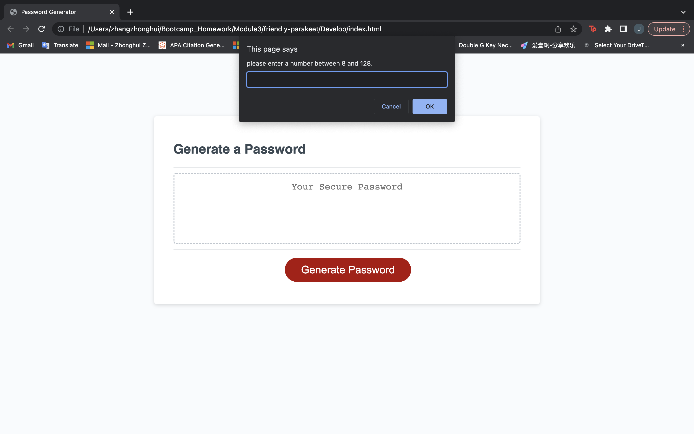
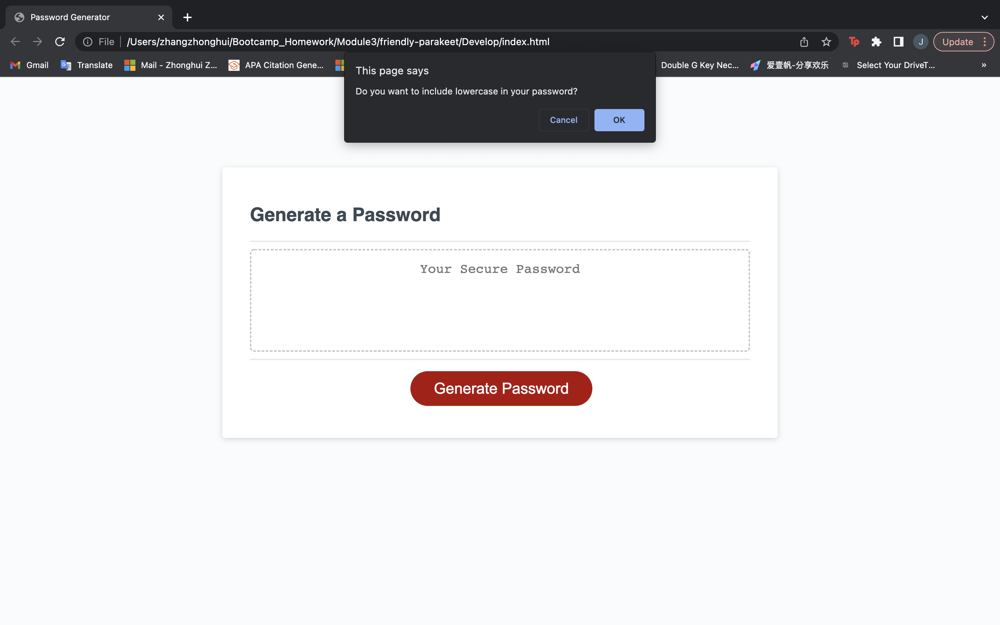
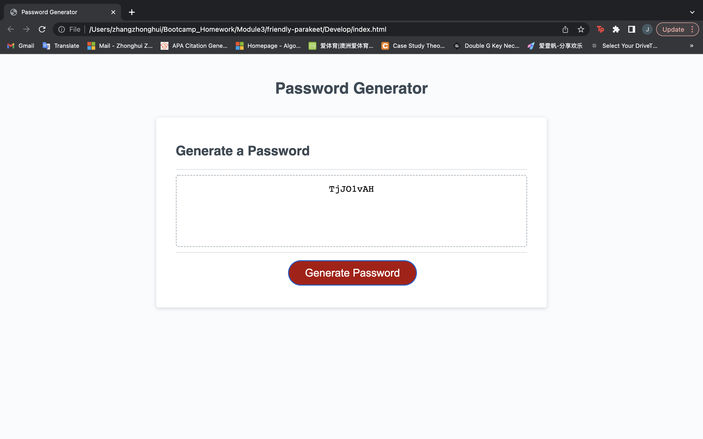
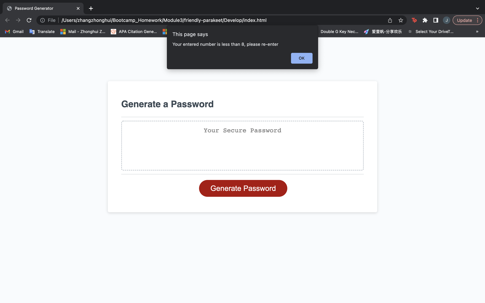
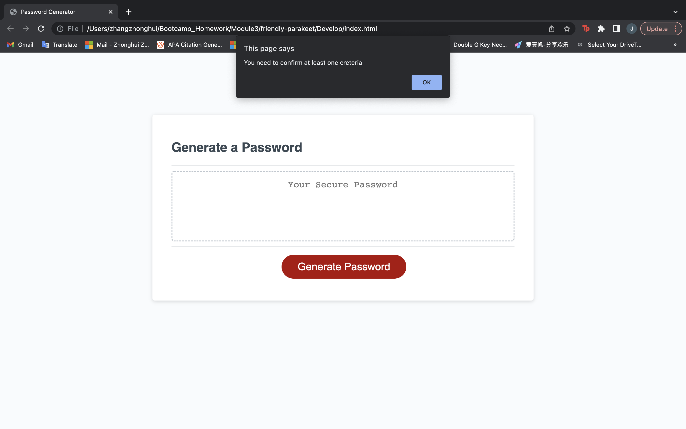

# Module 3 Javascript Password Generator Starter Code

## Description

- This project enables the audience to generate new and secure password by choosing password criteria 

## Usage

- Audience can input numbers and select password criteria in prompt window to create password fulfilling their security needs

## Images

## deployed application

[application link] (https://jennyzzhh.github.io/Module-3-Javascript/)
[Github link] (https://github.com/Jennyzzhh/Module-3-Javascript.git)

